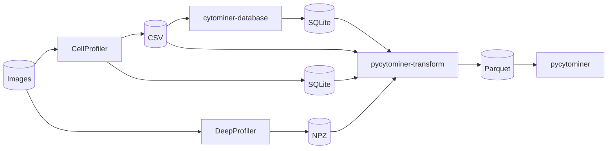

# pycytominer-transform

_Diagram showing data flow relative to this project._

## Summary

Pycytominer Transform will take inputs in the form of CSV's, SQLite, or NPZ, converting to [Pycytominer](https://github.com/cytomining/pycytominer) relevant output in parquet format.
The parquet files will have a unified and documented data model, including referenceable schema where appropriate (for validation within Pycytominer or other projects).

## References

- [pycytominer](https://github.com/cytomining/pycytominer)
- [cytominer-database](https://github.com/cytomining/cytominer-database)
- [DeepProfiler](https://github.com/cytomining/DeepProfiler)
- [CellProfiler](https://github.com/CellProfiler/CellProfiler)
- [cytominer-eval](https://github.com/cytomining/cytominer-eval)
