# CytoTable


_Diagram showing data flow relative to this project._

## Summary

CytoTable enables single-cell morphology data analysis by cleaning and transforming CellProfiler (`.csv` or `.sqlite`), cytominer-database (`.sqlite`), and DeepProfiler (`.npz`) output data at scale.
CytoTable creates parquet files for both independent analysis and for input into [Pycytominer](https://github.com/cytomining/pycytominer).
The Parquet files will have a unified and documented data model, including referenceable schema where appropriate (for validation within Pycytominer or other projects).

## Installation

Install CytoTable with the following command:

```shell
pip install git+https://github.com/cytomining/CytoTable.git
```

## Contributing, Development, and Testing

Please see [contributing.md](docs/source/contributing.md) for more details on contributions, development, and testing.

## References

- [pycytominer](https://github.com/cytomining/pycytominer)
- [cytominer-database](https://github.com/cytomining/cytominer-database)
- [DeepProfiler](https://github.com/cytomining/DeepProfiler)
- [CellProfiler](https://github.com/CellProfiler/CellProfiler)
- [cytominer-eval](https://github.com/cytomining/cytominer-eval)
